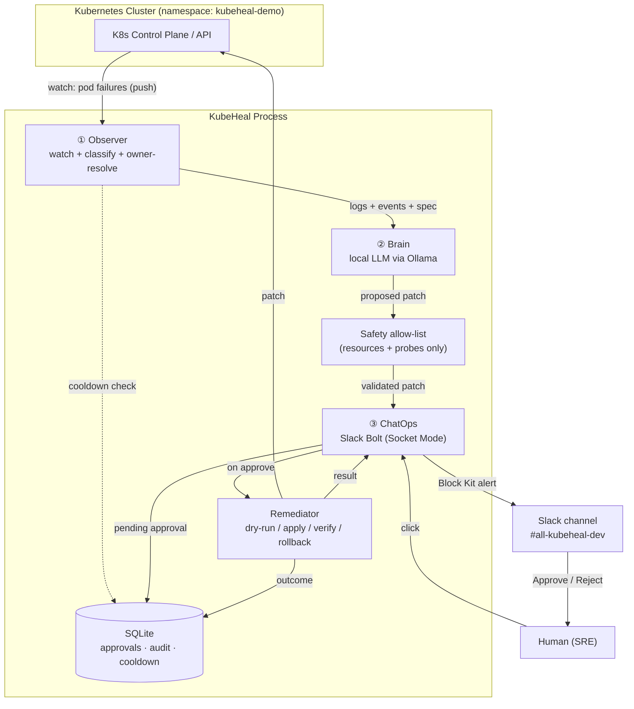
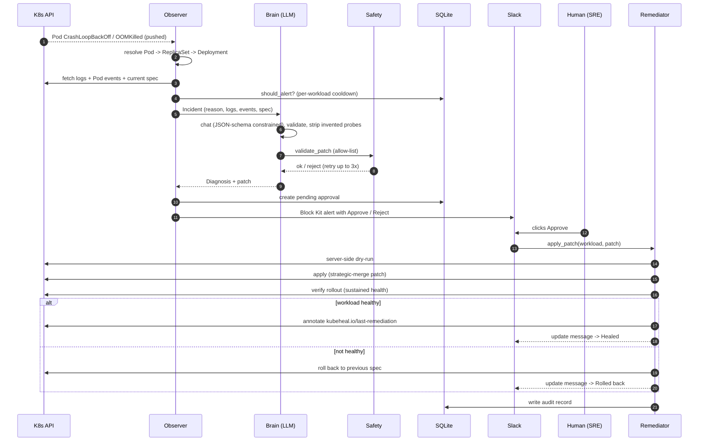
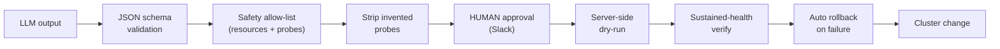

# KubeHeal — Architecture

> **One-line pitch:** KubeHeal is an event-driven agent that watches a Kubernetes
> cluster for failing pods, uses a **local** LLM to diagnose them and propose a
> fix, and applies that fix **only after a human approves it in Slack** — with
> dry-run, verification, and automatic rollback as safety nets.

The guiding principle is **autonomy with guardrails**: the AI *proposes*; humans
and a chain of safety checks *dispose*. The AI never mutates the cluster on its own.

---

## Component overview

The system is three decoupled components plus shared state:

1. **Observer** — *detection*. Listens to the K8s Watch API for pods entering bad
   states (`OOMKilled`, `CrashLoopBackOff`).
2. **Brain** — *diagnosis*. A local LLM (Ollama) turns the failure into a
   structured, validated patch.
3. **ChatOps + Remediator** — *human-in-the-loop + execution*. Posts to Slack,
   waits for an Approve/Reject click, then applies the patch with safety checks.

State (pending approvals, audit log, cooldown) lives in **SQLite** so it survives
process restarts.

---

## End-to-end flow (one incident)

If the Brain cannot produce a safe in-scope patch (e.g. the real fix needs an
image/config change), it posts a **"Needs a human"** message instead — nothing is
silently dropped.

---

## Defense in depth (why it's safe to let an AI near a cluster)

Six independent gates sit between the LLM and a running cluster:

Even a hallucinated patch cannot swap an image, escalate privileges, or change
the command — those fields are rejected by the allow-list before a human ever
sees the proposal.

---

## Components (file map)

| File | Responsibility | Key idea |
|------|----------------|----------|
| `config.py` | Settings from `.env` via `pydantic-settings` | One typed source of truth; secrets never in code |
| `kubeheal/models.py` | `Incident`, `Diagnosis`, enums | Pydantic models are the **contract** between components |
| `kubeheal/k8s.py` | Loads kubeconfig / in-cluster; API clients | Runs on a laptop or inside the cluster |
| `kubeheal/observer.py` | Watch loop, failure classification, owner resolution, cooldown | Event-driven, not polling |
| `kubeheal/log_fetcher.py` | Logs (+ previous container) and Pod events | Events reveal probe/scheduling failures |
| `kubeheal/brain.py` | Ollama call, schema-constrained JSON, retry, probe-strip | LLM output is validated, never trusted |
| `kubeheal/safety.py` | Patch **allow-list** + probe validation | The core guardrail |
| `kubeheal/slack_app.py` | Block Kit alerts, Approve/Reject handlers, Socket Mode | The human-in-the-loop |
| `kubeheal/remediator.py` | Dry-run -> apply -> verify -> rollback + annotation | The only thing that mutates the cluster |
| `kubeheal/store.py` | SQLite: approvals, audit log, cooldown | State survives restarts |
| `kubeheal/main.py` | Wires Observer (thread) + Slack (main thread) | Per-incident workers so a slow LLM call never blocks detection |
| `kubeheal/logging_setup.py` | Structured `ts level logger \| key=value` logs | Observability |

---

## Key design decisions & trade-offs

1. **Local LLM (Ollama), not a hosted API.** Data privacy — pod logs never leave
   the machine — and zero cost. Trade-off: a small 2B model is weaker, so we
   compensate with structure (schema, allow-list, explicit prompt heuristics).
2. **Slack Socket Mode, not webhooks + ngrok.** An outbound WebSocket needs no
   public URL, tunnel, or rotating-URL setup. Simpler and free.
3. **Event-driven Watch, not polling.** K8s pushes state changes; we react
   instead of scanning on a timer — lower latency and load.
4. **Safety allow-list is the heart of the design.** The LLM may only change
   `resources` and probes; everything else is rejected.
5. **Forced structured JSON output**, validated by Pydantic, with a corrective
   retry loop — small models emit messy text, this makes it machine-reliable.
6. **Target the Deployment, not the pod.** Patching an ephemeral pod is pointless;
   owner resolution makes fixes durable.
7. **SQLite for state.** Pending approvals survive restarts (no lost/double
   applies); also powers cooldown and the audit trail. Free, embedded, zero-ops.

---

## Two real bugs found by live testing

1. **Log-endpoint bytes bug.** The K8s Python client mis-deserializes pod logs and
   returns the string `repr` of bytes (`b'...'`). Fixed by reading the raw
   response with `_preload_content=False` and decoding.
2. **Verify false-positive.** A crash-looping pod with no readiness probe is
   briefly "ready" the instant it starts, so a single status poll falsely reported
   "healed." Fixed by requiring several **consecutive** healthy polls plus
   `observedGeneration >= generation`.

Plus a model-quality fix: the 2B model bolts bogus probes onto unrelated fixes,
so invented probes are **stripped deterministically in code** rather than relying
on the prompt.

---

## Tech stack

Python · `kubernetes` client (Watch + patch) · **Ollama** (`granite3.1-dense:2b`) ·
`slack-bolt` (Socket Mode) · Pydantic / pydantic-settings · SQLite · pytest ·
**Kind** local cluster · Docker. All free, all local.

---

## How it was built (phases)

Built bottom-up, each layer verified against a real cluster before adding the next:

- **Phase 0 — Scaffold:** repo layout, config, data-model contracts, stubs.
- **Phase 1 — Observer:** Kind cluster + deliberately-failing demos; watch loop,
  detection, owner resolution, log/event fetching.
- **Phase 2 — Brain:** Ollama + strict SRE prompt; schema-constrained diagnosis;
  the safety allow-list.
- **Phase 3 — ChatOps + Remediator:** Slack Socket Mode app; Approve/Reject;
  dry-run -> apply -> verify -> rollback; SQLite store; wiring.
- **Phase 4 — Hardening:** SQLite cooldown, annotation, structured logging,
  Dockerfile + in-cluster manifest; richer diagnosis (events); "needs a human"
  path; a genuinely-fixable bad-probe demo.

See [PLAN.md](PLAN.md) for the detailed task breakdown and [README.md](README.md)
for setup instructions.
